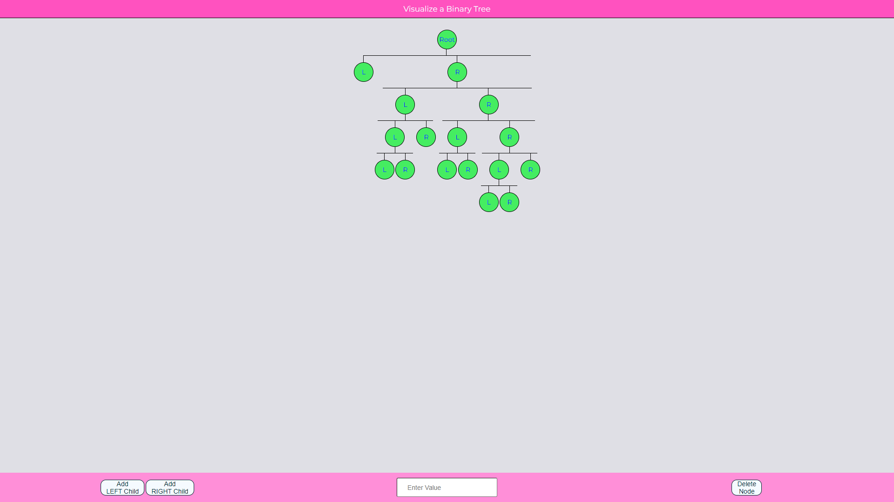

<h1 align="center">Visualize Binary Tree</h1>

  <h3>
    <a href="https://gh0stfreak.github.io/Visualize-Binary-Tree/" color="white" target="_blank">
      Live
    </a>
   | 
        <a href="https://www.cs.usfca.edu/~galles/visualization/BST.html" target="_blank">
      Reference
    </a>
  </h3>

 

## About The Project

This HTML, CSS & Js is a good challenge for anyone just starting out or anyone wanting a small project to play around with.

# Feature

- Pressing "KeyA" & "KeyD" can be used to append a child to a selected node

## Built with

- Semantic HTML5 markup
- CSS custom properties
- Flexbox
- Grid
- Desktop-only workflow

## What I learned

The postioning of elements and centering of elements was a bit of a challange. But it worked out in the end.
